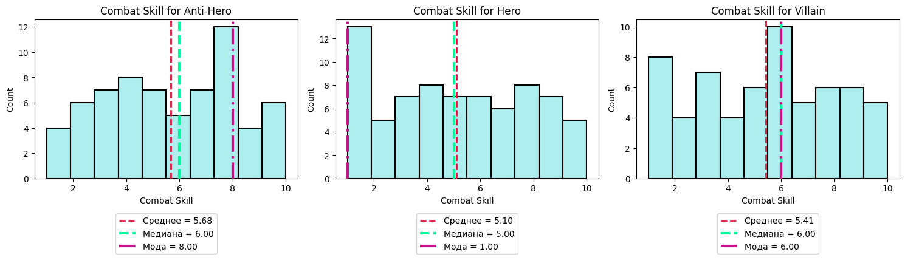

# superhero-eda-analysis
Цель — отработать навыки EDA, визуализации, статистики и простого ML

## Описание проекта

Этот проект направлен на анализ датасета супергероев для выявления закономерностей в характеристиках персонажей из разных вселенных и с разной моральной ориентацией.
Данные включают 200 наблюдений с информацией о силе, скорости, интеллекте, боевых навыках и других характеристиках героев.

[Ссылка на Google Collab](https://colab.research.google.com/drive/1avGvV8XmQpC8e5sGYl4yGs75sLih61en?usp=sharing)

**Стек проекта**:
- Python (pandas, numpy, matplotlib, seaborn)
- Статистика (scipy.stats, ANOVA, t-тест)
- ML (sklearn — KMeans, LinearRegression)

## Что сделано:

- Предобработка данных (заполнение пропусков, анализ структуры)
- Исследовательский анализ данных (EDA) с 10-ю исследовательскими вопросами
- Статистическое тестирование различий между группами персонажей
- Анализ корреляций между характеристиками
- Кластеризация персонажей для выявления типичных профилей

